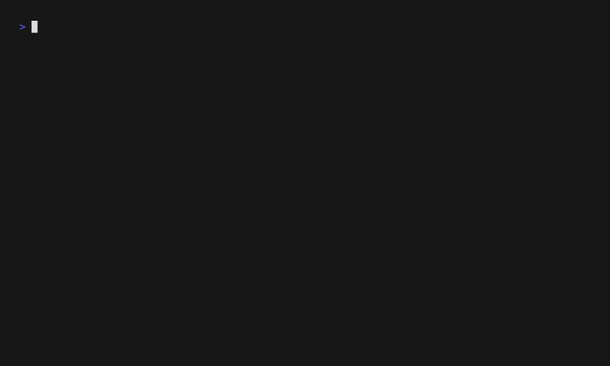

[](https://github.com/bodgit/rvz/releases)
[](https://github.com/bodgit/rvz/actions?query=workflow%3Abuild)
[](https://coveralls.io/github/bodgit/rvz?branch=main)
[](https://goreportcard.com/report/github.com/bodgit/rvz)
[](https://godoc.org/github.com/bodgit/rvz)


# Dolphin RVZ disc images

The [github.com/bodgit/rvz](https://github.com/bodgit/rvz) package reads the [RVZ disc image format](https://github.com/dolphin-emu/dolphin/blob/master/docs/WiaAndRvz.md) used by the [Dolphin emulator](https://dolphin-emu.org).

* Handles all supported compression methods; Zstandard is only marginally slower to read than no compression. Bzip2, LZMA, and LZMA2 are noticeably slower.

How to read a disc image:
```golang
package main

import (
	"io"
	"os"

	"github.com/bodgit/rvz"
)

func main() {
	f, err := os.Open("image.rvz")
	if err != nil {
		panic(err)
	}
	defer f.Close()

	r, err := rvz.NewReader(f)
	if err != nil {
		panic(err)
	}

	w, err := os.Create("image.iso")
	if err != nil {
		panic(err)
	}
	defer w.Close()

	if _, err = io.Copy(w, r); err != nil {
		panic(err)
	}
}
```

## rvz

The `rvz` utility currently allows you to decompress an `.rvz` file back to its original `.iso` format.

A quick demo:


